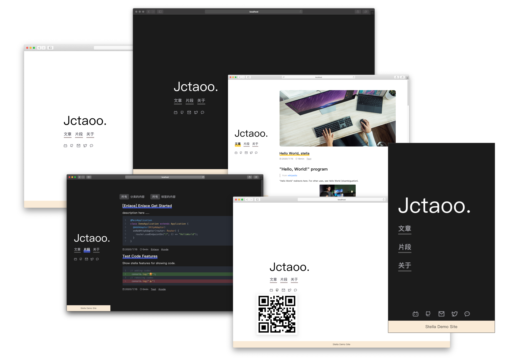

# Stella, an easy using and beautiful blog based on [Gatsby](https://github.com/gatsbyjs/gatsby)


## Overview

Welcome to Stella !! 🎉

Stella has three parts, Passages, Snippets, and About.
- Passages: To place all your passages.
- Snippets: To place something short and simple such as code snippets. (emm... Snippets just like Twitter tweets)
- About: To place your self-introduction.

## Usage (with code)

1. Install Gatsby cli:
```shell
# npm
npm install -g gatsby-cli
# yarn
yarn global dd gatsby-cli
```
2. Create your site:
```shell
gatsby new blog https://github.com/jctaoo/stella.git
```
3. Place your content in `./blog/content` and modify the field named `siteMetadata` in `./blog/gatsby-config.ts`. (For more detail, check [Gatsby Config API](https://www.gatsbyjs.com/docs/reference/config-files/gatsby-config/))

## Usage (without code)

1. Create a directory to place your blog content.
2. Put following directory and file in your repository:
   - posts: (dir) Corresponding to part 'Passages'.
   - snippets: (dir) Corresponding to part 'Snippets'.
   - posts: (file) Corresponding to part 'about.md'.
   - config.json: (file) check [Configure Options](./Configure%20Options.md)
3. Place any content you want in below directory or file.

## Debug / Test your site

Unfortunately, there isn't a good way to debug with the code-less installation way now.

In the first way to install, you can use the following steps:
- Run `yarn start` or `npm run start` to view your site.
- If you want to modify your content, just stop the above command and restart it. (Hot reload comming soon...)

## Deploying

## License

[](https://opensource.org/licenses/0BSD)

0BSD License

Copyright (c) 2021 jctaoo

[LICENSE](https://github.com/jctaoo/stella/blob/master/LICENSE) file
